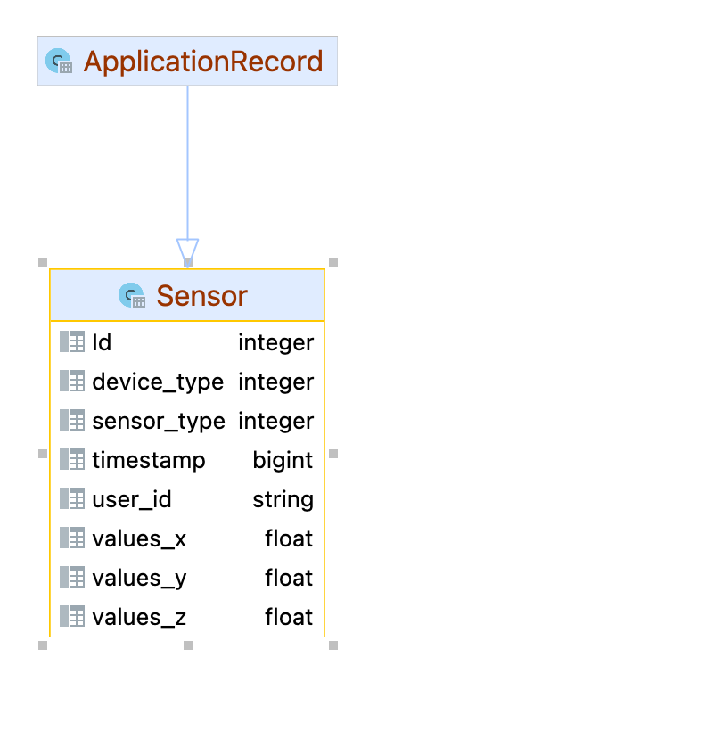

# API de conexión para la BBDD de experimentos de MYDASS

> VERSIÓN 1.0

El proyecto se realiza sobre un contenedor Docker, por lo que es necesario tener instalado Docker en el equipo para realizar las tareas de desarrollo y pruebas.

Se ha utilizado la versión Alpine de Ruby para reducir el tamaño del contenedor. Es una aplicación Rails en modo API-Only, que en un futuro se puede extender a una aplicación web. Se provee para tener un punto de acceso a los datos de forma segura y centralizada siguiendo ciertos estándares recogidos bajo el REpresentational State Transfer (REST).

## Instalación

Tener instalado Docker y Docker-Compose en el equipo.

Realizar sobre la carpeta del proyecto:

```bash
docker compose up --build
```

Con esto, estaremos ejecutando los siguientes contenedores:

- **db**: Contenedor para replicar la BBDD de MySQL que se está utilizando actualmente en el proyecto.
- **web**: Contenedor para ejecutar la API Rails.
- **phpmyadmin**: Contenedor para acceder a la BBDD de MySQL mediante una UI.

Los puertos sobre los que se ejecutan son los siguientes:

- **db**: 3306
- **web**: 3000
- **phpmyadmin**: 8081

Los cuales son totalmente modificables y configurables.

## Modelo de datos



El modelo de datos en la versión 1.0 de la API es el siguiente:

- **Sensors**: Es la tabla de sensors de la BBDD que representa una medición de un sensor cualquiera para un sujeto de experimentación del tipo XXX-000.
  - **id**: Identificador único de la medición.
  - **device_type**: Tipo de dispositivo que ha realizado la medición. (puede ser de una E4 o de un TicWatch)
  - **sensor_type**: Tipo de sensor del que se registra la medición.
  - **timestamp**: Momento en el que se realiza la medición en estilo Unix Timestamp
  - **user_id**: Identificador del usuario al que pertenece la medición. (Ej. XXX-000)
  - **values_x**: Valor de la medición en el eje X o, en su defecto, si solo se tiene un valor, aquí es donde se almacenará.
  - **values_y**: Valor de la medición en el eje Y.
  - **values_z**: Valor de la medición en el eje Z.

## Controladores

Se han creado dos controladores, `SensorsController` y `UsersController`, que se encargan de gestionar las peticiones a la API.

### SensorsController

Este controlador se encarga de gestionar las peticiones a la tabla `sensors` de la BBDD. Se han creado los siguientes métodos:

- **index**: Devuelve todos los registros de la tabla `sensors`. _**Cuidado cuando se llama a este método, ya que puede ser muy pesado y tirar el servidor**_.
- **byuser**: Devuelve todos los registros de la tabla `sensors` de un **usuario concreto**. Acepta parámetros opcionales de `timestamp_ini` y `timestamp_end` para filtrar por rango de tiempo (Unix Style).
- **bysensortype**: Devuelve todos los registros de la tabla `sensors` de un tipo de **sensor concreto, para un sujeto concreto**. Acepta parámetros opcionales de `timestamp_ini` y `timestamp_end` para filtrar por rango de tiempo (Unix Style).
- **bydevicetype**: Devuelve todos los registros de la tabla `sensors` de un tipo de **dispositivo concreto, para un sujeto concreto**. Acepta parámetros opcionales de `timestamp_ini` y `timestamp_end` para filtrar por rango de tiempo (Unix Style).
- **bydevicesensor**: Devuelve todos los registros de la tabla `sensors` de un tipo **de dispositivo concreto y un tipo de sensor concreto, para un sujeto concreto**. Acepta parámetros opcionales de `timestamp_ini` y `timestamp_end` para filtrar por rango de tiempo (Unix Style).

Estos métodos proveen de una forma de acceder a los datos de forma segura y centralizada, siguiendo los estándares REST. Esto resulta en los siguientes endpoints:


### UsersController

Este controlador se encarga de gestionar las peticiones a la tabla `sensors` de la BBDD extrayendo información sobre los usuarios. Se han creado los siguientes métodos:

- **index**: Devuelve los identificadores de los usuarios únicos de los que se tienen registro en la BBDD de `sensors`.
- **timestamps**: Devuelve el primer y último timestamp de medición de todos los usuarios.
- **timestampsbyuser**: Devuelve el primer y último timestamp de medición de un usuario concreto.

Estos métodos resultan en los siguientes endpoints:


### DevicesController

Este controlador se encarga de gestionar las peticiones a la tabla `sensors` de la BBDD extrayendo información sobre los dispositivos. Se han creado los siguientes métodos:

- **index**: Devuelve los tipos de **dispositivos únicos, junto con sus sensores** de los que se tienen registro en la BBDD de `sensors`.

## Seguridad

Como la API que se ha provisto, es sólo de lectura de la base de datos, no se han podido seguir completamente buenas prácticas, ya que debe implementarse un modelo de usuarios en los que se tenga una clave API para cada uno de ellos, de forma que se pueda trazar el uso de la API según el usuario que realice la petición. Esto se queda como trabajo futuro.

Sin embargo, sí que se ha provisto de una capa de seguridad para evitar que se pueda acceder a la API por cualquier tipo de usuario. Para ello, se ha utilizado una clave JWT de acceso de 2048 bits que se debe enviar en el header como Bearer token. Si no se provee esta clave no se permite las consultas a la API.

La clave es una cadena muy sensible ya que si se tiene acceso a ella, se pueden hacer todo tipo de lecturas sobre la base de datos. Por lo tanto, se debe mantener en un lugar seguro y no compartirlo con nadie.

## Pruebas

> Pruebas pendientes de realizar

[//]: # (TODO: Añadir pruebas)

## Endpoints

Puedes consultar los endpoints y sus detalles consultando [su documentación](/docs/api_endpoints.md) o, si lo prefiere, puede visualizarlos de forma interactiva en la documentación de Postman, donde podrá probar las peticiones a la API y obtener código autogenerado para solicitar los datos en su lenguaje de programación favorito.

[](https://documenter.getpostman.com/view/15069603/2s93CGQvX9)